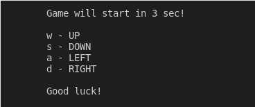

# go-threadsnake

This is a small and simple version of the Snake game written with Go.

## How does it look like

There are a few screenshoots of game

### Hello screen

### Game with the default settings

### Game with custom settings
