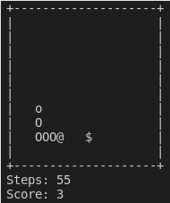
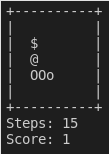

# go-threadsnake

This is a small and simple version of the Snake game written with Go.

## Usage

```
  go-threadsnake [OPTIONS]

Application Options:
  -v, --version  Show version

  -s, --size=    Set the size of playing field, from 5 to 40
                 default value = 10, means 10 rows and (10 * 2 =) 20 columns

  -t, --tempo=   Set the tempo of moving the snake, from 1 to 20
                 default value = 2, means (60 sec / 2 =) 30 sec for a step


Help Options:
  -h, --help     Show this help message

```

## Game control
The next keys set the direction for the snake
```
w - UP
s - DOWN
a - LEFT
d - RIGHT
```


## How does it look like

There are a few screenshoots of games

 

## What next

The list of features for the next releases looks so:
- [ ] (Bug) sometimes fruit can spawn on a snake body
- [ ] Start playing by Enter
- [ ] Pause
- [ ] A special separated button to quit
- [ ] Homebrew Tap
- [ ] Save and recovery progress